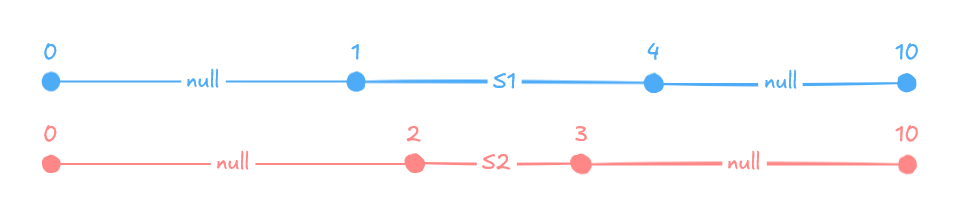
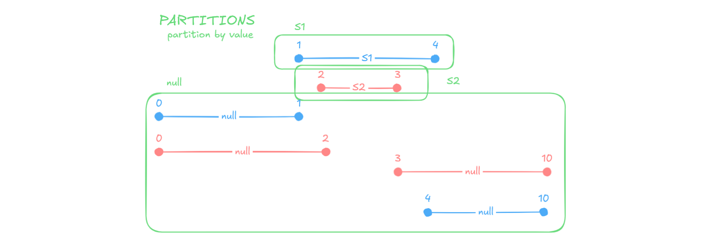
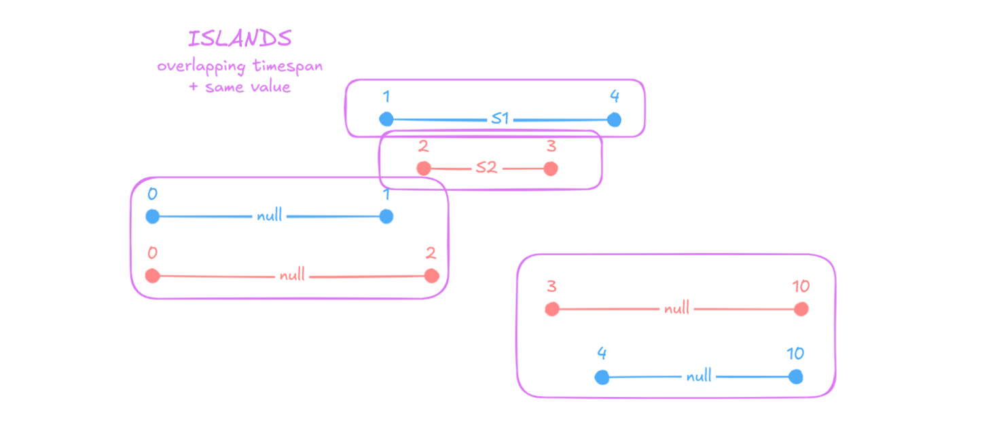

# Overlapping Records

Imagine having a table with valid from and valid to timestamps. There may be cases where there is some overlap between two timestamps, resulting in redundant data.

In the example below there are two records describing `property_b`to be `null`between 0 and 1, similarly there are two records describing `property_b`to be `null`between 4 and 10.


|property_a  | property_b  | start_date  |end_date |
|--|--|--|--|
|I1      |NULL     |0             |1           |
|I1      |S1       |1             |4           |
|I1      |NULL     |4             |10          |
|I1      |NULL     |0             |2           |
|I1      |S2       |2             |3           |
|I1      |NULL     |3             |10          |


## Islands & Gaps
To get rid of rows containing duplicate information, the islands & gaps methodcan be used. This method identifies clusters/islands of overlapping records and eliminates them.


### Partitioning
The first step is to partition the data by all of the relevant properties. Each partition is ordered first by `start_date` and then by `end_date`.

In this case there are only 2 properties: `property_a` and `property_b`; and only `property_b` has a changing value between records. As a result there are 3 distinct partitions created, one where `property_b` has a value of `S1`, one where it has a value of `S2`, and one where it has a value of `null`.



### Islands
These partitions are used to add the previous `end_date` to each record. This in turn can be used to identify the start timestamp of an island (i.e. cluster of overlapping records).

An island starts when
- It is the first record of a partition (i.e. `previous_end_date` is `null`)
- The record does not overlap with the previous record (i.e. `start_date` is after the previous `end_date`)



```sql
island_start_timestamps AS (
    SELECT
        *,
        LAG(end_date) OVER (PARTITION BY isin, sedol ORDER BY start_date, end_date) AS previous_end_date,
        CASE
            WHEN previous_end_date IS NULL OR start_date > previous_end_date + 1 THEN 1
            ELSE 0
        END AS island_start_flag,
    FROM
        distinct_data
)
```


| property_a | property_b  | start_date  |end_date | previous_end_date  |island_start_flag |
| -- | --|--|--|--|--|
|I1      |S1       |1             |4           |NULL             |1                    |
|I1      |S2       |2             |3           |NULL             |1                    |
|I1      |NULL     |0             |1           |NULL             |1                    |
|I1      |NULL     |0             |2           |1                |0                    |
|I1      |NULL     |3             |10          |2                |1                    |
|I1      |NULL     |4             |10          |10               |0                    |


In order to group all of the records belonging to the same island together, a cummulative sum across the afformentioned partitions can be used to create an island identifier. The reason for this is that as the `island_start_flag` is either 1 or 0:
- any time the flag is 0, the cummulative sum will not increase the identifier, correctly labeling the current record as the same island as the previous record
- any time the flag is 1, the cummulative sum will increase the identifier by 1, correctly labeling the current record as a new island identifier

A cummulative sum (opposed to a total sum) can be achieved by adding an `ORDER BY` clause to the window partition.

```sql
islands AS (
    SELECT
        *,
        SUM(island_start_flag) OVER (PARTITION BY property_a, property_b ORDER BY start_date, end_date) AS island_id
    FROM island_start_timestamps
)
```

|island_id  |property_a  |property_b  |start_date  |end_date  |previous_end_datet  |island_start_flag  |
|--|--|--|--|--|--|--|
|1           |I1      |S1       |1             |4           |NULL             |1                    |
|1           |I1      |S2       |2             |3           |NULL             |1                    |
|1           |I1      |NULL     |0             |1           |NULL             |1                    |
|1           |I1      |NULL     |0             |2           |1                |0                    |
|2           |I1      |NULL     |3             |10          |2                |1                    |
|2           |I1      |NULL     |4             |10          |10               |0                    |
-----------------------------------------------------------------------------------------------------

### Deduplication
For each island (i.e. group of overlapping records) a new record can be created that starts at the smalles start timestamp and ends at the largest end timestamp.


```sql
SELECT
    MIN(start_date) AS start_date,
    MAX(end_date) AS end_date,
    property_a,
    property_b,
FROM islands
GROUP BY property_a, property_b, island_id
ORDER BY start_date
```


| property_a | property_b  |start_date  | end_date  |
|--|--|--|--|
|I1      |NULL     |0             |2           |
|I1      |S1       |1             |4           |
|I1      |S2       |2             |3           |
|I1      |NULL     |3             |10          |
